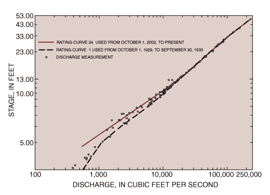
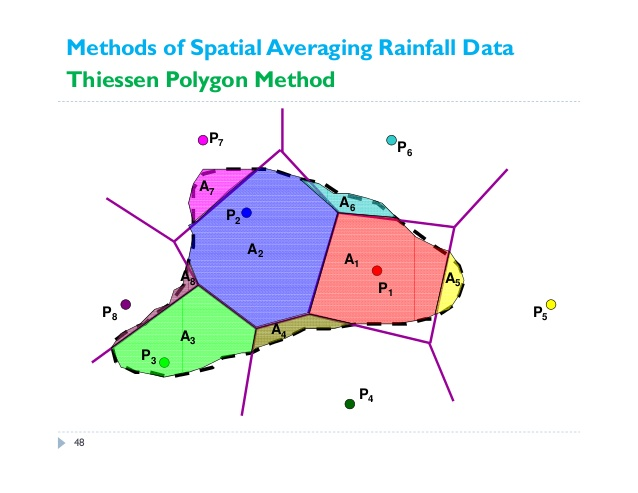
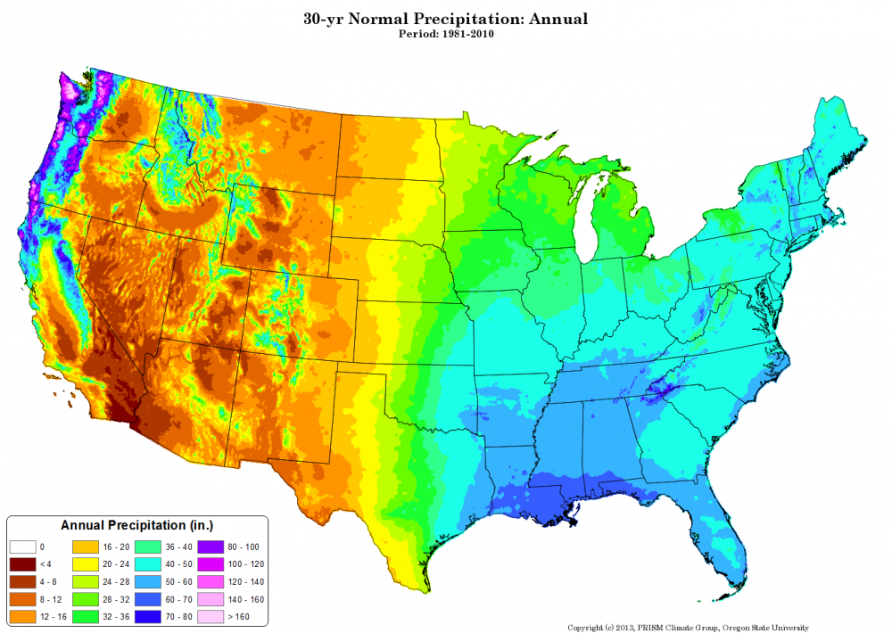
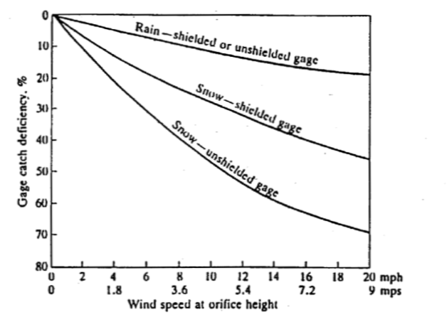
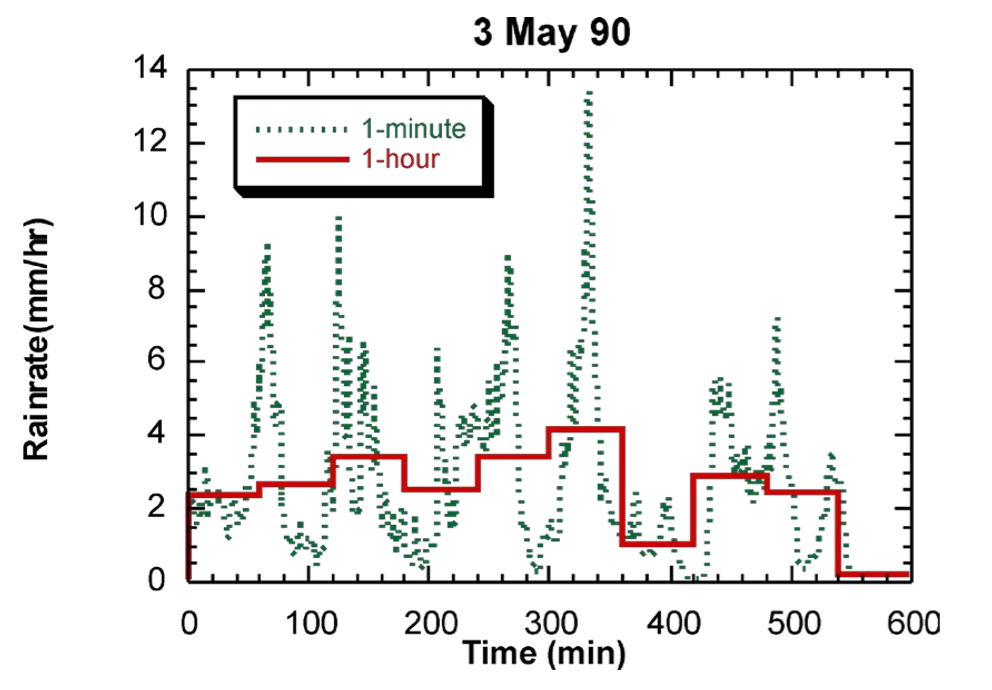

=======================
1/28/2019 Notes
=======================

Streamflow
===========

USGS archives high quality river data.
`USGS NWIS <https://nwis.waterdata.usgs.gov/nwis>`_.
Most streamgauges transmit in real-time.
Lots of information available online.

Measuring Streamflow
----------------------

USGS measures river stages and convert it to discharge.
Plotting River Stage vs. Flow Rate to develop a rating curve.
USGS will fit the curve between the most recent data.
For extreme events, there is much uncertainty about how to extrapolate beyond the normal measured stages.

Example:

As a comparison, you can you

Precipitation
==================

``Showing a picture of a research-grade tipping-bucket gage.``
``Talking about potential errors using the tipping bucket and how it works.``

How do we use precipitation gauges?
Usually precip gauges are sparsely populated.
Can use the Thiessen Polygon method to determine weighting factors.

Example:

What is normal precipitation?
Normal precipitation is the 30-year average.
PRISM datasets are great to see the 30-year average.

Errors
--------
Precip gages tend to under predict precipitation. 
Precip gauges can be designed in a way to minimize this error, like shielding or heating a gauge (snow especially).

Knowing the precip type, windspeed, and shielded or unshielded, we can estimate the "Catch Deficiency", or:

:math:`CD(%) = \frac{P_{true} - P_{gage}}{P} * 100%`

**Spatial Undersampling** Gauges tend to miss spatial variations in precipitation, as evidence in the comparison below.

.. image:: images/SpatialUndersampling.png

**Temporal Undersampling**: Gauges tend to miss temporal variations in precipitation, as evidence in the comparison below.

Solutions
-----------
Multisensor radar/gauge products provide gridded hourly precipitation estimates.
Combining NEXRAD with raingauges can provide between precipitation estimates.
Name: **Quantitative Precipitation Estimates** is a catch all for everything.

