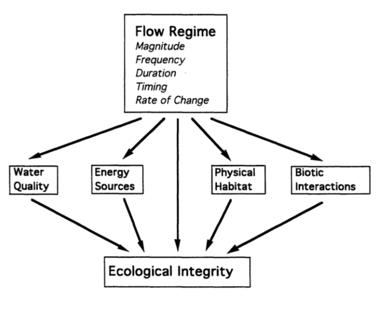
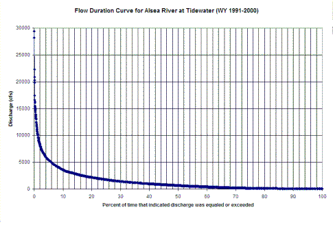

=======================
2/11/2019 Notes
=======================

``Talking aobut the reading Dam Nation 1999 publication and broad brushstrokes on the future of dams.``

``NOTE: Dams change river dischares in the United State to a much greater degree than any adjustments anticipated from global climate change for the near future.``

``... The exact affects of climate change are unknown, but the effects of dams are known.``

Natural Flow Regime
=======================

Term coined by N. LeRoy Poff in 1997 publications.

Characteristic (measures) of streamflow and implications:

- Magnitude
- Frequency (Flow rate vs. % excedance, See flow duration analysis fig)
- Duration
- Timing
- Rate of Change

	This is a standard way to look at Magnitude and Frequency in this coupled way.

Response to altered Flow Reg

- Hydrologic Changes
- Geomorphic Changes (fluvial)
- Ecological Changes

Streamflow Management
-------------------------
When we change a river, we have started to think about how to mitigate the change's impact. Want to achieve **Environmental flow requirements**. 

Common approaches are:

- Focus on a species *(eg. Trout)*
- Establish minimum allowable flows

Limitations:

- Good ecosystem. Attempt at equivalent would be: *good for a single species*... BUT NOT THE SAME.
- Required habitat characteristics are not described by minimum allowable flows.

However... there are more sophisticated approaches.

- Instream flow incremental methodology (use computer software, for example)

	- links hydraulic and physical habitat preferences (fish)

- Physical Habitat Simulation (PHABSIM), software

