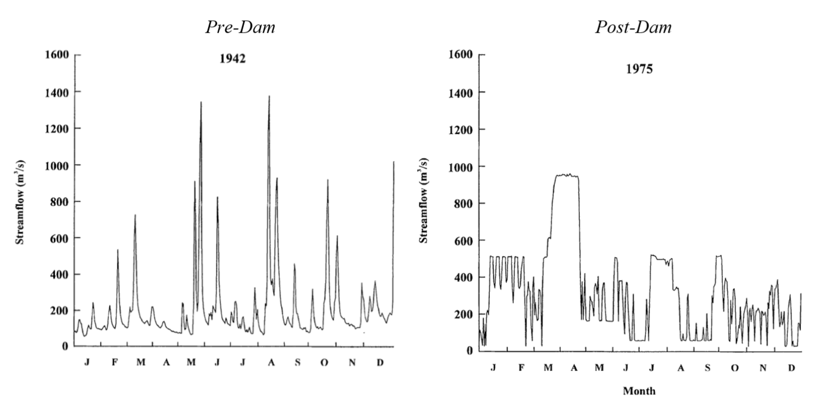
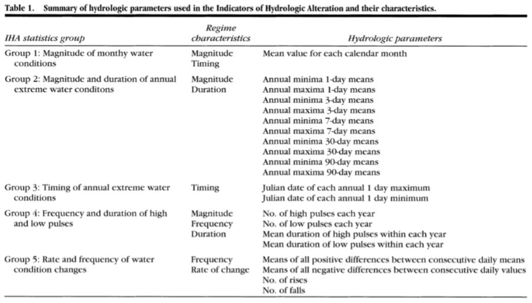
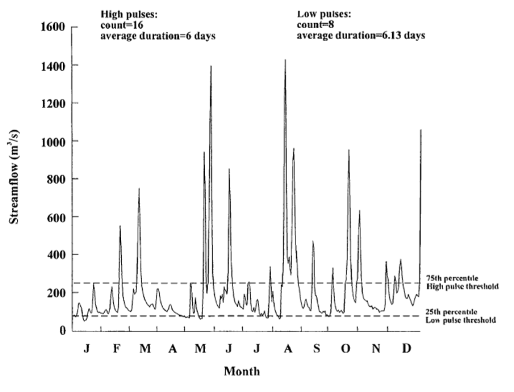
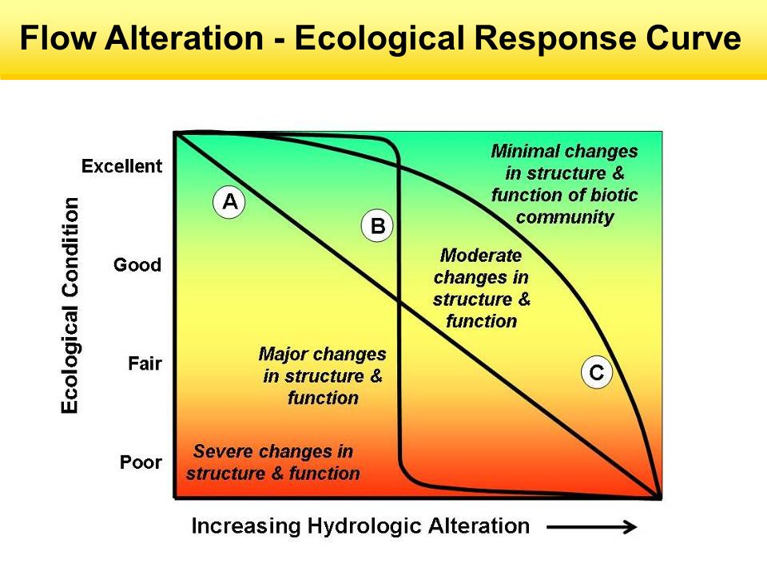

=======================
2/13/2019 Notes
=======================

``Class note: we will not have an in-class exam. Instead we are going to have a take-home project-like exam.``

Environmental Flows; Part 1
=============================

Measures for Flow Regimes
--------------------------

Indicators of Hydrologic Alteration:
- **IHA Software (TNC)**: compare pre- and post-alteration flow regimes. Assessment is done through a "bunch of statistics".

	Frequency and duration of high and low flow pulses

``Problem 8 will require you to use the IHA Software. Can choose to work in groups of 3.``

Environmental Flows
---------------------

**Assessment:** scientifically evaluate tradeoff. Would like to measure the tradeoffs of humans alterations to the flow regime (IHA).

We also need to look at the changes to ecosystem health. Could be related to losses in fish habitat, bug counts, etc. This exercise is difficult, costly, time consuming. One approach is called the **Ecological Limit of Hydrologic Alterations** (ELOHA). The outcome is a *scientific basis for assigning target flows*.

ELOHA Framework
^^^^^^^^^^^^^^^^^^^^

Synthesize hydrologic/ecologic data (and take action)

	- Scientific Process
	- Social Process
	- Monitoring and evaluation

Geographic (regional) Approach
	
	- River/watershed
	- State/region

Scientific Process
^^^^^^^^^^^^^^^^^^^^

Develop Flow Alteration and Ecological Response.

	1. **Build the hydrologic foundation**. (Characterize flows.) Get baseline observation (pre- & post- alteration), Hydrologic simulation models (prediction at ungaged sites, or alterations for a proposed change.)
	2. **Classify River Segments**. Look at the similarity of ecologically relevant flow statistics.
	3. **Computing the Flow Alteration**.  Group river segments based on evaluation of conditions. Deviation for baseline conditions.
	4. **Develop Flow Alteration - Ecological Response function**.

``Wants to conceptualize this with a graph.``

	This isn't 