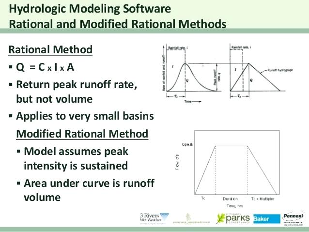
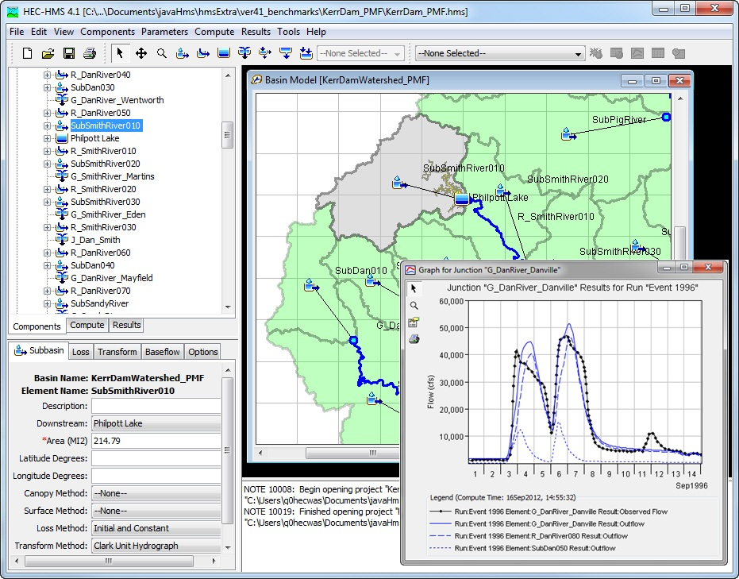
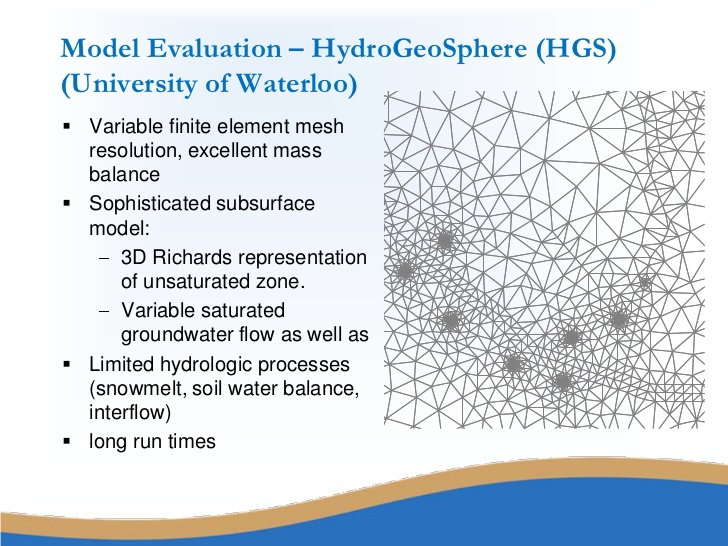

=======================
2/27/2019 Notes
=======================

``Reviewed problem 8 homework.``

``Get the precip value, although he's not requiring us.``

Models
========

Generally, going to be concerned with computer models. Not physical models. Many types of computer models in the hydrologic space. Like "rainfall-runoff" models.

Common Models:
	
	- `WRF-HYDRO <https://ral.ucar.edu/projects/wrf_hydro/overview>`_
	- `Sacramento <https://www.nws.noaa.gov/oh/hrl/general/chps/Models/Sacramento_Soil_Moisture_Accounting.pdf>`_
	- `EPA SWMM <https://www.epa.gov/water-research/storm-water-management-model-swmm>`_
	- `HSPF (EPA) <https://www.epa.gov/ceam/hydrological-simulation-program-fortran-hspf>`_
	- `SWAT Model <https://swat.tamu.edu/>`_
	- `HEC-HMS <https://www.hec.usace.army.mil/software/hec-hms/>`_	
	- `HEC-RAS <https://www.hec.usace.army.mil/software/hec-ras/>`_

``He's now referencing the handout... add in handout later.``

``Making the point that our models are never 100% physical models.``

Rational Method
----------------

Pretty simple model. Formula is:

:math:`Q_{p} = CiA`

where:
	- :math:`Q_{p}` is Peak Flow
	- :math:`C` is the runoff coefficient
	- :math:`i` is rainfall intensity
	- :math:`A` is the drainage area

HEC HMS
-----------

HSPF
-------

Comparison
-------------

+------------------+-------------------------+-----------+----------------+------------+-------------+
| Hydrologic Model | Laws and Approximations | Equations | Parameters     | Time       | Computation |
+------------------+-------------------------+-----------+----------------+------------+-------------+
| Rational Method  | Emperical               | Stat      | Lump           | --         | Analytical  |
+------------------+-------------------------+-----------+----------------+------------+-------------+
| HEC-HMS          | Both EMP/Concept        | Det       | Lump/Semi-Dist | Event      | Numerical   |
+------------------+-------------------------+-----------+----------------+------------+-------------+
| HSPF             | Conceptual              | Det       | Lump/Semi-Dist | Continuous | Numerical   |
+------------------+-------------------------+-----------+----------------+------------+-------------+
| HGS              | Most Physical           | Det       | Distributed    | Both       | Numerical   |
+------------------+-------------------------+-----------+----------------+------------+-------------+