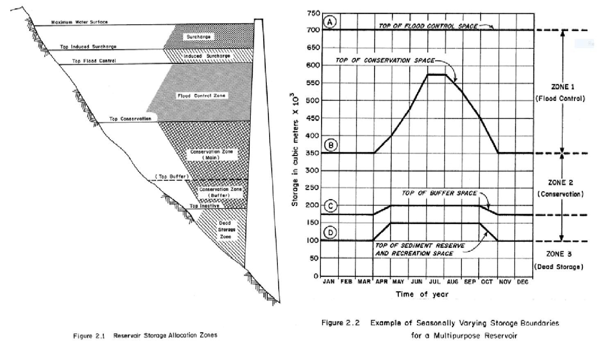
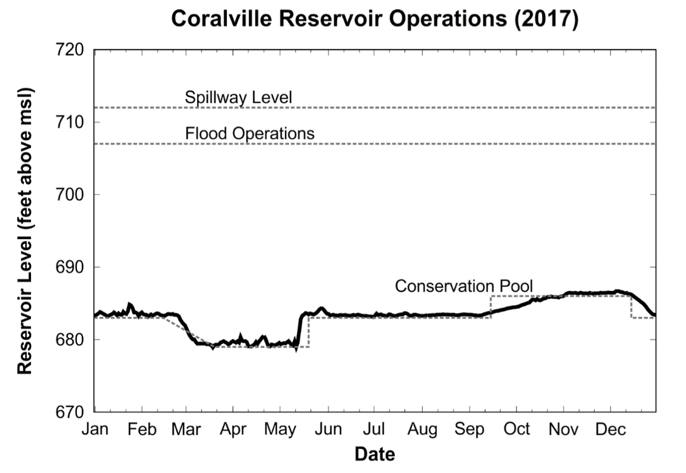
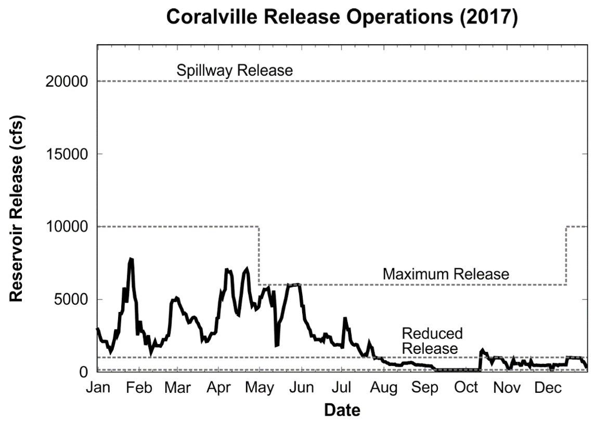
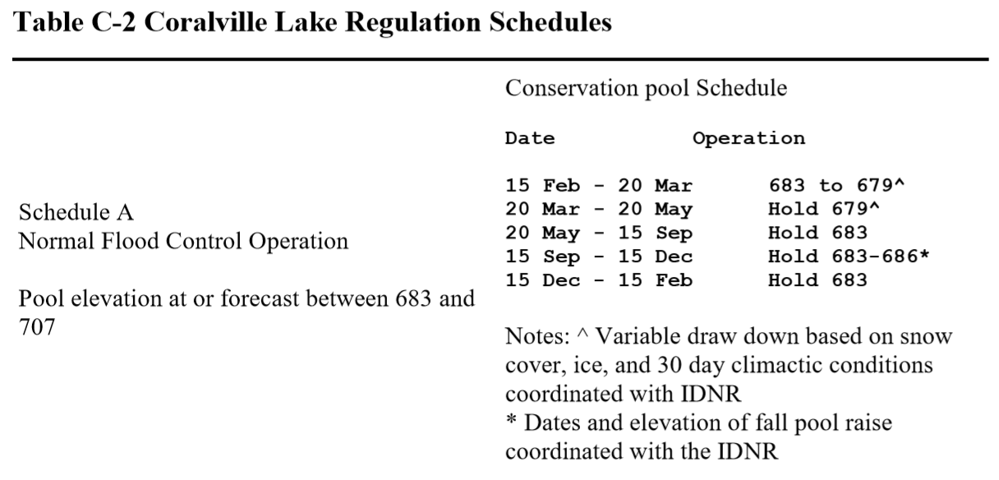
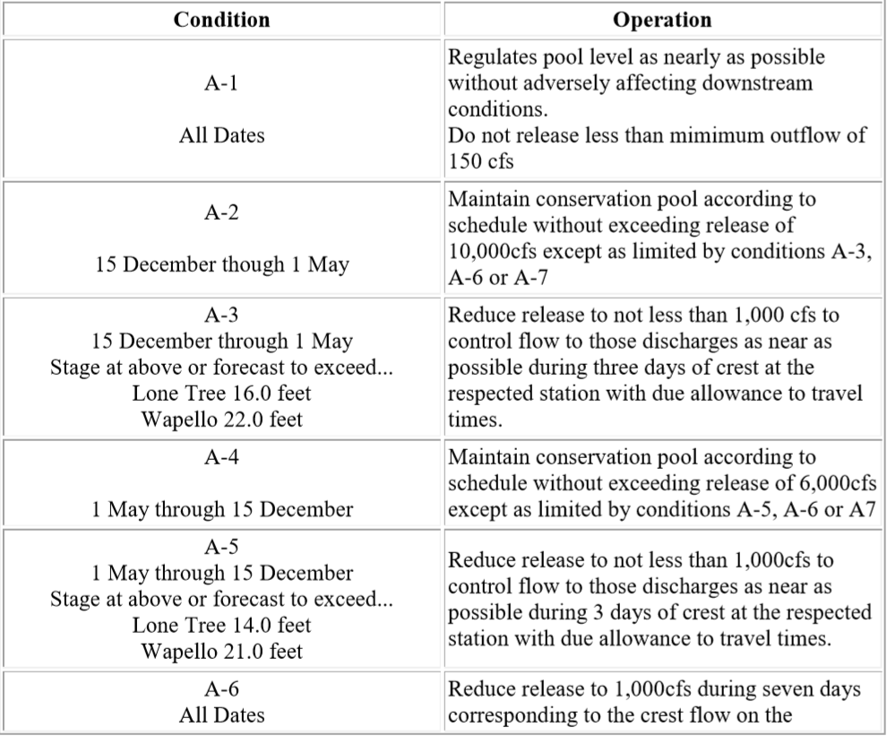

=======================
2/8/2019 Notes
=======================

Reservoir Zones
==================

``Drawing an image on the board... Three levels of storage in a reservoir``

1. Dead Zone
2. Useful Storage
3. Surcharge Storage

Within the useful zone, the storage volume can be apportioned for different purposed. Also, these zones can change over time (ie. seasonally).  Example picture below.

Storage Reservoirs with Controlled Operations
================================================

In order to meet these objectives and for planning purposes, you manage a reservoir using "Rule Curves" which guide reservoir releases.

Schedules are mutually exclusively, collectively exhaustive.

- Schedule A is normal condition,
- Schedule B is flood condition,
- Schedule B is drought condition.

An example of these schedules can be found below.

Reservoirs in the U.S.
========================

National Inventory of Dams (NID), completed by USACE.
Set up criteria for counting.

	- Dam greater than 6 ft high & greater than 50 acre-feet
	- 25 ft high & 15 ac-ft
	- Any size that poses a high hazard

Majority of dams in registry for Iowa are 25-50 ft high (3000+). ~4,000 in total.

Over 90,000+ dams in the US. Most of the dams were built in the 60s.

