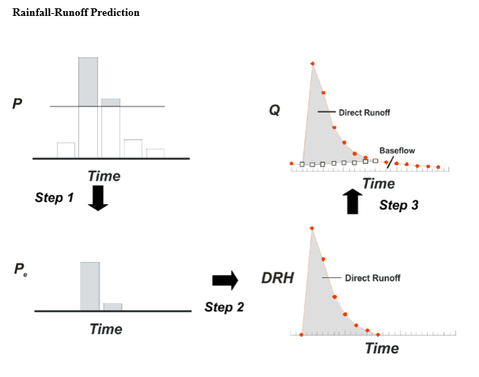
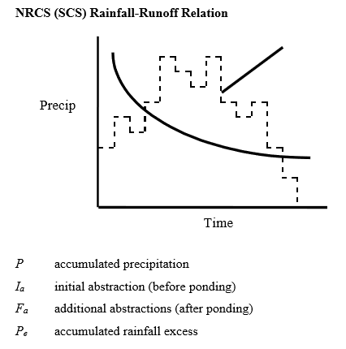
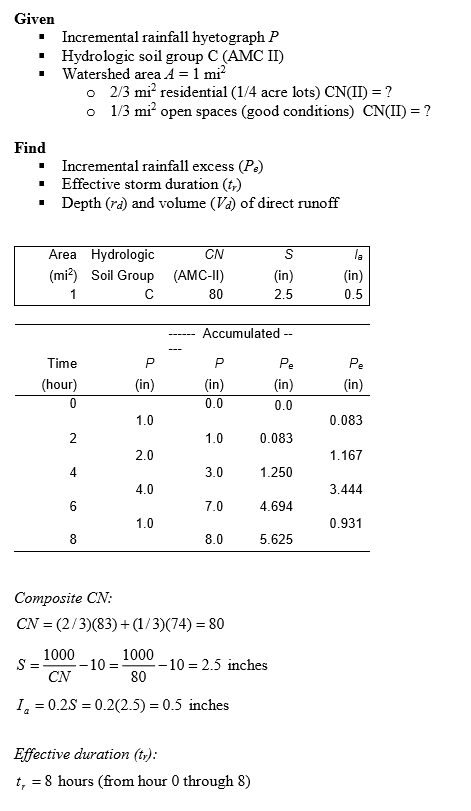

=========================
3/1/2019 Notes
=========================

NRCS (SCS) Runoff Method
=========================

Water Balance:

	:math:`P = P_{e} + I_{a} + F_{a}`

	:math:`P_{e} = P - I_{a} - F_{a}` while :math:`P \geq I_{a}`

Define:
	
	- :math:`S` as the potential maximum retention storage. :math:`F_{a}` is a thought of as a fraction of the storage, :math:`S`, :math:`\frac{F_{a}}{S}`

This means:

	:math:`\frac{F_{a}}{S} = \frac{P_{e}}{P-I_{a}}`

.. note:: The above is the basis as the **SCS Assumption**.

Substituting and solving...
	
.. math::
	
	P_{e} = \begin{array}{cc} 
	\{ &
	\begin{array}{cc}
	0 & P \leq I_{a} \\
	{\frac{(P-I_{a})^2}{P-I_{a} + S}} & P \geq I_{a} \\
	\end{array}
	\end{array}

.. note:: A common SCS assumption :math:`I_{a} = 0.2 \times S`. **Model becomes 1 parameter model of :math:`S`.**

:math:`S` is abstracted/related to the runoff curve number, :math:`CN`, which :math:`0<CN<100`.

.. note:: :math:`S = \frac{1000}{CN} - 10`

``NOW WE DO AN EXAMPLE!!! WOOOOOOOH``

