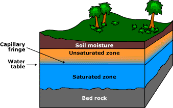
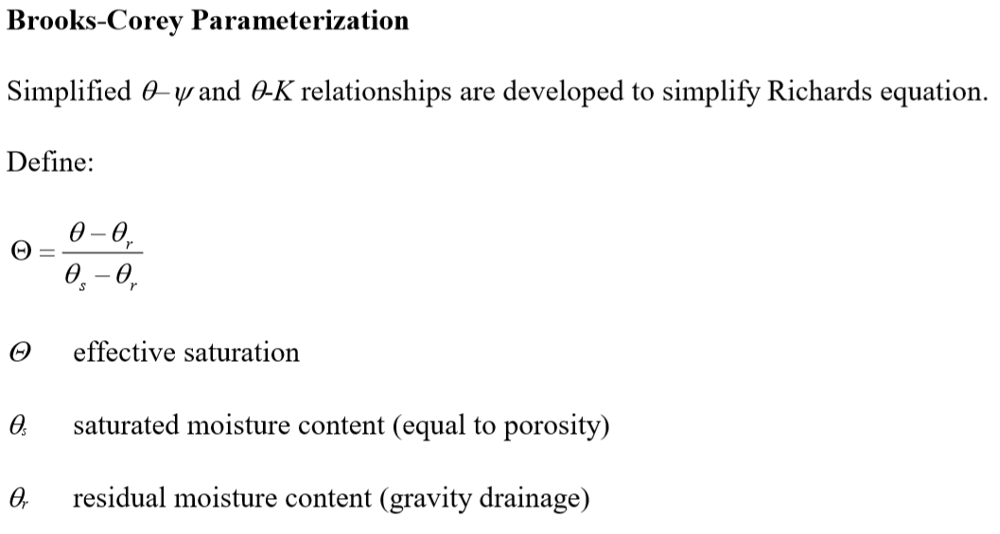
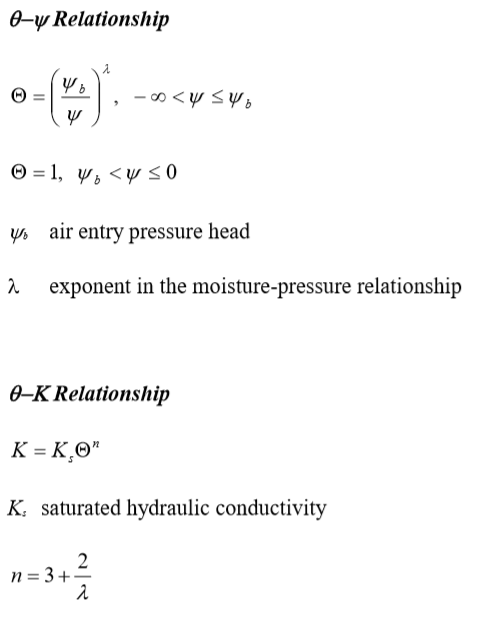

=========================
3/6/2019 Notes
=========================

``Did a quick run through of some soil types: alluvial, colluvial, lusts, glacial till, etc.``

Soils and Modeling
=========================

Soil Properties
----------------

**Soil Porosity**, :math:`\zeta`, is defined by:

	:math:`\zeta = \frac{V_{v}}{V}`

where:
	
	- :math:`V_{v}` is the pore volume,
	- :math:`V` is the total volume 

**Soil Water Content**, :math:`\Theta`, is defined as:

	:math:`\Theta = \frac{V_{w}}{V}`

where:
	
	- :math:`V_{w}` is the volume of water in the control volume
	- :math:`V` is the total volume of the control volume

Rule of thumb:

	:math:`\Theta_{r} \leq \Theta \leq \zeta`

Check out the diagram below for vocab for different locations. In the saturated zone, all pore space is filled with water, ie no water.

Soil Water Movement
-------------------

``Drawing a pic on the board to work toward "Darcy Flux".``

Darcy Flux, with length, L, over time, T, is represented as:
	:math:`q = \frac{Q}{A}` 

Conservation of Mass
^^^^^^^^^^^^^^^^^^^^^^^^^^^^

	:math:`\frac{\partial \Theta}{\partial t} = \frac{\partial q}{\partial z}`

Conservation of Energy
^^^^^^^^^^^^^^^^^^^^^^^^^^

Total Hydraulic Head (:math:`h` with length L)
	:math:`h = \frac{P_{c}}{\gamma} + z`

where:
	- :math:`P_{c}` is the Pressure term
	- :math:`\gamma` is the unit weight (specific weight) of water (:math:`\gamma= \rho \times g`)
	- :math:`z` is the elevation

.. note:: We can ignore the term :math:`\frac{v^{2}}{2g}` because velocity is really really small compared to the terms in the energy equation.

The first term is commonly thought of as the suction pressure (negative), and called the "**matrix or capillary potential**" or :math:`\Psi (\Theta)`.
	:math:`h = \Psi (\Theta) + z`

Conservation of Momentum
^^^^^^^^^^^^^^^^^^^^^^^^^^^^

Conservation of momentum for groundwater flow is refered to as `Darcy's Law <https://en.wikipedia.org/wiki/Darcy%27s_law>`_:
	:math:`q = -K(\Theta) \frac{\partial h}{\partial z}`

where:
	- :math:`K(\Theta)` is the *hydraulic conductivity*

.. note:: **HOMEWORK** :math:`q = - \overline{K(\Theta)} \frac{\Delta h}{\Delta z}`

1-D Unsaturated Flow
-----------------------
Combine conservation of mass and momentum equation:
	:math:`\frac{\partial \Theta}{\partial t} = - \frac{\partial q}{\partial z} = + \frac{\partial}{\partial z} \left[ K(\Theta) \frac{\partial h}{\partial z} \right]`

	...

	simplifying to the **Richard's Equation**

	...

	:math:`\frac{\partial \Theta}{\partial t} = \frac{\partial}{\partial z} \left(D(\Theta) \frac{\partial \Theta}{\partial z} \right) + \frac{\partial K(\Theta)}{\partial z}`

	...

	written another way

	...

	:math:`D(\Theta) = K(\Theta) \frac{\partial \Psi(\Theta)}{\partial z}`

``Photos of Brooks-Corey...``

